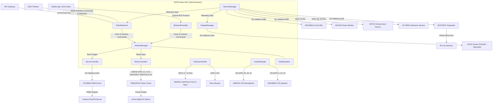

# 🤖 REX-47 Robot Car Firmware (v1.1.0)

> **Repository `02`** · Advanced modular firmware for the REX-47 autonomous robot car. Features real-time motor control via TB6612FNG & MCP23017, pan-tilt camera servo stabilization using PCA9685, BLE control interface, multi-sensor telemetries (MPU6050 IMU, DHT22, Ultrasonic, IR Line grid), INA226 high-side power metrics, OLED animated face expressions, dual-channel I2S audio (microphone/speaker), HTTP registration, and MQTT integration.

[]()
[]()
[]()
[]()
[]()

---

## 🧭 System Architecture

The firmware runs on a central ESP32 MCU coordinating low-level hardware actuators, feedback sensors, connectivity protocols, and multi-channel audio/visual components.



---

## 📦 Firmware Structure

```
02-rex-firmware/
└── RexFirmware/                      ← Main ESP32 Controller Project
    ├── RexFirmware.ino               ← Entry point, initialization, and main execution loop
    ├── include/
    │   ├── Config.h                  ← Global pins, configurations, limits, and addresses
    │   └── RobotStates.h             ← Definition of 25 operating, emotional, and subsystem states
    └── src/
        └── modules/
            ├── audio/                ← I2S speaker (MAX98357) & microphone (INMP441) manager
            ├── bluetooth/            ← BLE GATT server for local command control
            ├── camera/               ← Placeholder for camera integrations
            ├── display/              ← U8G2 OLED manager with animated face expressions (DisplayEyes)
            ├── indicators/           ← NeoPixel and buzzer state-based animation controllers
            ├── motion/               ← Coordinates TB6612FNG motors & sweeps pan-tilt camera servos
            ├── motor_control/        ← TB6612FNG motor driver using ESP32 PWM + MCP23017 logic
            ├── mqtt_client/          ← Placeholder for modular MQTT client (integrated in Network)
            ├── network/              ← WiFiManager captive portal, API registration, and MQTT
            ├── ota/                  ← Placeholder for Over-The-Air updates
            ├── safety/               ← Soft safety boundary deceleration for servos
            ├── sensors/              ← Polling for MCP23017, MPU6050, DHT22, HC-SR04, and INA226
            └── servo_control/        ← PCA9685 I2C 16-channel PWM servo interface
```

> [!NOTE]
> The source directories [ota/](RexFirmware/src/modules/ota), [camera/](RexFirmware/src/modules/camera), and [mqtt_client/](RexFirmware/src/modules/mqtt_client) inside the firmware folder are currently empty structure placeholders. Their respective functionalities are handled by the integrated [RobotNetwork](RexFirmware/src/modules/network) module.

---

## 🔌 Hardware Wiring & Address Allocation

### Microcontroller
* **Main Compute**: ESP32 Development Board (e.g. ESP32-WROOM-32D).

### Dual I²C Bus Architecture
To ensure stability and I2C bandwidth, the ESP32 utilizes two separate hardware I2C buses running at 100 kHz (`I2C_CLOCK_SPEED`):
* **I²C Display Bus**: `SDA` (GPIO 21) | `SCL` (GPIO 22)
* **I²C Sensor Bus**: `SDA` (GPIO 32) | `SCL` (GPIO 33)

| Device | I²C Address | Role | Notes |
|---|---|---|---|
| **MCP23017** | `0x20` | 16-channel GPIO Expander | Controls motor direction pins & reads IR line grid |
| **OLED Screen** | `0x3C` | 128x64 visual display dashboard | Configurable for SH1106 or SSD1306 drivers |
| **PCA9685** | `0x40` | 16-Channel PWM Servo Driver | Standardized for 50Hz analog pan-tilt servos |
| **INA226** | `0x45` | High-Side Power & Current Monitor | Reads battery levels; solder bridge configured for `0x45` |
| **MPU6050** | `0x68` | 6-Axis Accelerometer & Gyroscope | Provides tilt, orientation, and motion tracking |

### Actuators

#### TB6612FNG Motor Driver
High-speed speed control (PWM) is driven directly by ESP32 hardware pins. Directional logic pins are routed through the MCP23017 expander's Port B to save ESP32 GPIOs:
* **Left PWMA (Speed)**: GPIO 14
* **Right PWMB (Speed)**: GPIO 13
* **Left AIN1 / AIN2 (Direction)**: MCP GPB0 (Pin 8) / GPB1 (Pin 9)
* **Right BIN1 / BIN2 (Direction)**: MCP GPB2 (Pin 10) / GPB3 (Pin 11)
* **Standby (STBY)**: MCP GPB4 (Pin 12)

#### PWM Camera Pan-Tilt Servos (PCA9685)
* **Channel 0**: Pan Rotation Servo (`PAN_SERVO_CH`)
* **Channel 1**: Tilt Rotation Servo (`TILT_SERVO_CH`)

### Sensors & Peripherals

#### IR Line Sensors (MCP23017 Port A)
* **GPA0 (Pin 0)**: Left Outer Sensor (`IR_PIN_OUT1`)
* **GPA1 (Pin 1)**: Left Inner Sensor (`IR_PIN_OUT2`)
* **GPA2 (Pin 2)**: Right Inner Sensor (`IR_PIN_OUT3`)
* **GPA3 (Pin 3)**: Right Outer Sensor (`IR_PIN_OUT4`)

#### Collision & Environmental Sensors (ESP32 Pins)
* **DHT22 (Temp & Humidity)**: GPIO 23
* **HC-SR04 (Ultrasonic)**: Trigger (GPIO 18) | Echo (GPIO 19)

#### Dual I2S Audio System (ESP32 Pins)
* **INMP441 Microphone**: SCK (GPIO 25) | WS (GPIO 26) | SD (GPIO 27)
* **MAX98357 Speaker Amplifier**: BCLK (GPIO 16) | LRC (GPIO 15) | DIN (GPIO 2)

#### Visual & Sound Indicators (ESP32 Pins)
* **WS2812 NeoPixels**: Front Strip (GPIO 17) | Back Strip (GPIO 12) | 10 LEDs per strip
* **Piezo Buzzer**: GPIO 4

---

## 📡 Connectivity Protocols

### 1. HTTP API Registration
On startup, once connection to the network is established, the ESP32 registers itself with the central API gateway:
* **Endpoint**: `POST http://192.168.1.100:9000/api/v1/robots/register`
* **Content-Type**: `application/json`
* **Payload Structure**:
  ```json
  {
    "robot_id": "REX-47-ROBOT-CAR",
    "serial_key": "1234-5678-9012-3456",
    "name": "REX-47 Robot Car",
    "model": "ESP32-REX-CAR",
    "firmware_version": "1.1.0"
  }
  ```

### 2. MQTT Telemetry & Controls
The integrated MQTT client registers a Last Will and Testament (LWT) and updates the status when booting or losing network coverage.

#### Subscribes (Commands IN)
* **`robots/REX-47-ROBOT-CAR/commands/move`**: Directional/Coordinate locomotion.
  * Direct coordinate drive:
    ```json
    {
      "x": 0.5,
      "y": -0.2
    }
    ```
  * Command directions (e.g., `FORWARD`, `BACKWARD`, `LEFT`, `RIGHT`):
    ```json
    {
      "direction": "FORWARD",
      "speed": 85.0
    }
    ```
  * Stop:
    ```json
    {
      "command": "stop"
    }
    ```
* **`robots/REX-47-ROBOT-CAR/commands/camera`**: Camera Pan-Tilt orientation.
  * Angle coordinate targets:
    ```json
    {
      "pan": 90.0,
      "tilt": 120.0
    }
    ```
  * Single joint targeting:
    ```json
    {
      "servo": "pan",
      "angle": 90.0
    }
    ```

#### Publishes (Telemetry OUT)
* **`robots/REX-47-ROBOT-CAR/status`** *(Retained, LWT)*:
  ```json
  "ONLINE" // Options: ONLINE, OFFLINE
  ```
* **`robots/REX-47-ROBOT-CAR/telemetry`** *(Every 2 seconds)*:
  ```json
  {
    "robot_id": "REX-47-ROBOT-CAR",
    "timestamp": 31405,
    "sensors": {
      "ir": {
        "left_outer": true,
        "left_inner": false,
        "right_inner": false,
        "right_outer": true
      },
      "env": {
        "temperature": 27.8,
        "humidity": 55.4
      },
      "imu": {
        "accel": [-0.01, 0.05, 9.81],
        "gyro": [0.0, 0.01, 0.0]
      },
      "power": {
        "voltage": 7.42,
        "current": 210.5,
        "power": 1561.9
      }
    },
    "camera": {
      "pan": 90.0,
      "tilt": 90.0
    }
  }
  ```

### 3. Bluetooth BLE Protocol
The BLE handler exposes a standard GATT server for direct, local serial communications.
* **Device Broadcast Name**: `REX_47_BLE`
* **Service UUID**: `4fafc201-1fb5-459e-8fcc-c5c9c331914b`
* **Characteristic UUID**: `beb5483e-36e1-4688-b7f5-ea07361b26a8` (Read, Write, Notify, Indicate)
* **Accepted Formats**:
  * **Mobility Drive**: `M:<x>:<y>` or `M:<direction>:<speed>`
  * **Single Camera Servo**: `J:<servo_index>:<angle>` (e.g. `J:0:90` sweeps pan to 90°)
  * **Dual Camera Angles**: `A:<pan_angle>:<tilt_angle>` (e.g. `A:90.0:120.0`)
  * **Emergency Stop**: `ESTOP` or `E` or `E:` (Stops all DC motor movement)

---

## 🛡️ Safety & Motion Control Systems

### Smooth Interpolation
To protect camera mounting gears and stabilize video feeds, the [MotionManager](RexFirmware/src/modules/motion/MotionManager.h) filters target adjustments over a 20ms frame loop:
```cpp
currentAngle += (targetAngle - currentAngle) * DEFAULT_SMOOTH_FACTOR;
```
*(where `DEFAULT_SMOOTH_FACTOR` defaults to `0.12f`)*

### Virtual Soft-Limits & Deceleration
The [SafetySystem](RexFirmware/src/modules/safety/SafetySystem.h) calculates bounds and scales down movement speeds linearly if a camera servo sweeps within **15 degrees** of its physical limits to prevent mechanical damage:
```cpp
if (direction < 0 && distanceToMin < 15) {
    safeSpeed *= (distanceToMin / 15.0f);
}
```

### Self-Test Sweeps
On initialization, the robot performs a startup check to calibrate and verify the range of its actuators:
1. **Pan Servo**: Sweeps $45^\circ$ Left, $45^\circ$ Right, and centers at $90^\circ$.
2. **Tilt Servo**: Sweeps $30^\circ$ Down, $30^\circ$ Up, and centers at $90^\circ$.
3. **DC Motors**: Drives Forward at 60%, Backward at 60%, spins Left, spins Right, and stops.

---

## 👁️ OLED Animated Face & Telemetry Visuals

The [DisplayManager](RexFirmware/src/modules/display/DisplayManager.h) utilizes the `U8g2` library to render a layout consisting of:
* **Status Header**: Displays the local IP address and MQTT connectivity state.
* **Telemetry Grid**: Refreshes power statistics (voltage, current) and environment properties (temp, humidity).
* **Animated Eyes (DisplayEyes)**: Generates smooth, organic face animations based on the robot's active state:
  * **Neutral/Idle**: Moves eyes randomly and blinks periodically.
  * **Sleeping**: Renders closed eye arcs (used during charging or low power).
  * **Happy**: Curves eyes upwards during success states or user identification.
  * **Surprised / Alert**: Expands pupil diameters when obstacles are detected.
  * **Angry**: Slants eyes downward (used for threat warnings or intruder alerts).
  * **Dead (X)**: Displays "X" characters (used during critical errors or emergency stops).

---

## 🛠️ Compilation & Getting Started

### Required Arduino Libraries
Install the following libraries via the Arduino Library Manager:
1. **Adafruit PWM Servo Driver Library** (by Adafruit) — PCA9685 PWM controller.
2. **Adafruit MCP23017 Arduino Library** (by Adafruit) — GPIO Expander helper.
3. **Adafruit MPU6050** (by Adafruit) — IMU sensors.
4. **INA226_WE** (by Wolles Elektronik Kiste) — Power monitor.
5. **DHT sensor library** (by Adafruit) — DHT22 temperature/humidity.
6. **U8g2** (by Oliver Kraus) — OLED driver.
7. **Adafruit NeoPixel** (by Adafruit) — WS2812 RGB LED strips.
8. **PubSubClient** (by Nick O'Leary) — MQTT integration.
9. **ArduinoJson** (by Benoit Blanchon) — JSON parsing & serialization.
10. **WiFiManager** (by tzapu) — Captive portal provisioning.

### Configuration
Before compiling, review and adjust network properties and target ranges in [Config.h](RexFirmware/include/Config.h):
* **WiFi and API Fallback**:
  ```cpp
  #define FALLBACK_WIFI_SSID      "TP-Link_D664"
  #define FALLBACK_WIFI_PASSWORD  ""
  #define API_REGISTER_URL        "http://192.168.1.100:9000/api/v1/robots/register"
  ```
* **MQTT Settings**:
  ```cpp
  #define MQTT_BROKER             "192.168.1.100"
  #define MQTT_PORT               1883
  #define MQTT_USER               ""
  #define MQTT_PASS               ""
  ```
* **Display Driver**: Choose between SH1106 and SSD1306 drivers:
  ```cpp
  #define OLED_DISPLAY_DRIVER     DISPLAY_DRIVER_SH1106
  ```

### Uploading Firmware
1. Open [RexFirmware.ino](RexFirmware/RexFirmware.ino) in the Arduino IDE.
2. Select your ESP32 board (e.g. `ESP32 Dev Module`).
3. Compile and flash the code.
4. Open the Serial Monitor at **115200 baud** to view system logs and self-test results.

---

## 📈 Feature Roadmap

| Module | Feature Description | Status |
|:---:|---|:---:|
| **Motion** | Smooth Exponential Servo Interpolation | ✅ Implemented |
| **Motion** | TB6612FNG Differential & Direct Drive | ✅ Implemented |
| **Motion** | Startup Calibration Sweeps & Self-Test | ✅ Implemented |
| **Safety** | Virtual Boundary Deceleration Zones | ✅ Implemented |
| **OLED** | U8G2 Organic Eyes & Expressions | ✅ Implemented |
| **Indicators** | NeoPixel State-Based Lights & Buzzer Tones | ✅ Implemented |
| **Audio** | Dual I2S Microphone (INMP441) & Speaker (MAX98357) | ✅ Implemented |
| **Sensors** | Integrated IMU, DHT22, HC-SR04, IR Grid & INA226 | ✅ Implemented |
| **BLE** | GATT Server Custom Command Protocol | ✅ Implemented |
| **Network** | WiFiManager Provisioning, HTTP Register, & MQTT Telemetry | ✅ Implemented |
| **Motion** | Replay recording scripts | ⏳ Planned |
| **System** | Over-the-air (OTA) updates | ⏳ Planned |
| **Camera** | ESP32-CAM video integration | ⏳ Planned |

---

<div align="center">
  <sub>Part of the <strong>REX-47</strong> Autonomous Robotic Platform Ecosystem</sub>
</div>
